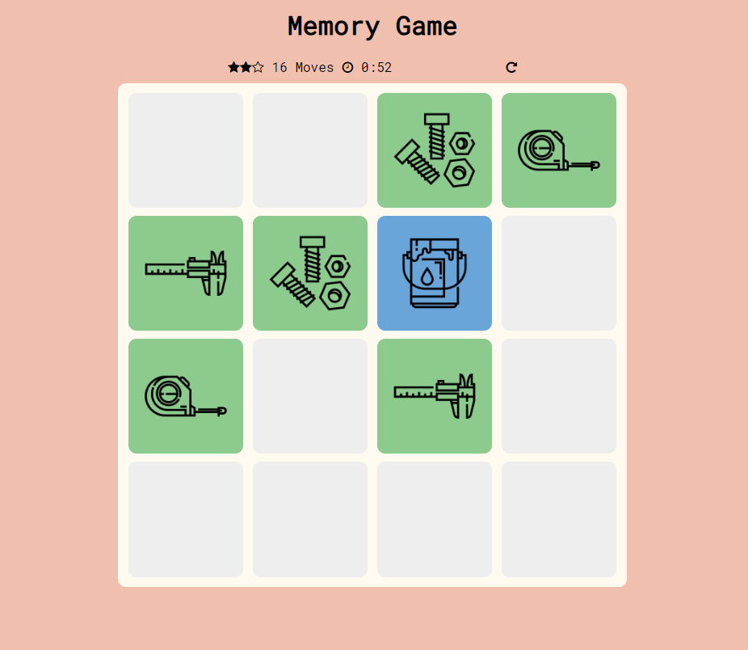

# Memory Game Project

A simple memory game using JavaScript to manipulate the DOM.



## Getting Started

These instructions will get you a copy of the project up and running on your local machine to start playing.

### Dependencies

* [Font Awesome](https://fontawesome.com/)
* [Google Fonts](https://fonts.google.com/)

### Installing

Clone with HTTPS

```
git clone https://github.com/costas90/memory-game.git
```

or Download as a zip.

Then open ```index.html``` to open the game in your browser and start playing!

### How to Play

Click on each card to flip it, and try to match 2 cards with the same symbol. Once you match all cards, you win!

The game will count your moves, time spent until winning the game, and give you a star rating. The more stars you have at the end of the game, the better your performance.

## License

This project is licensed under the [MIT License](License.md).

### Acknowledgments

This project is part of the Frontend Nanodegree from Udacity.com.
